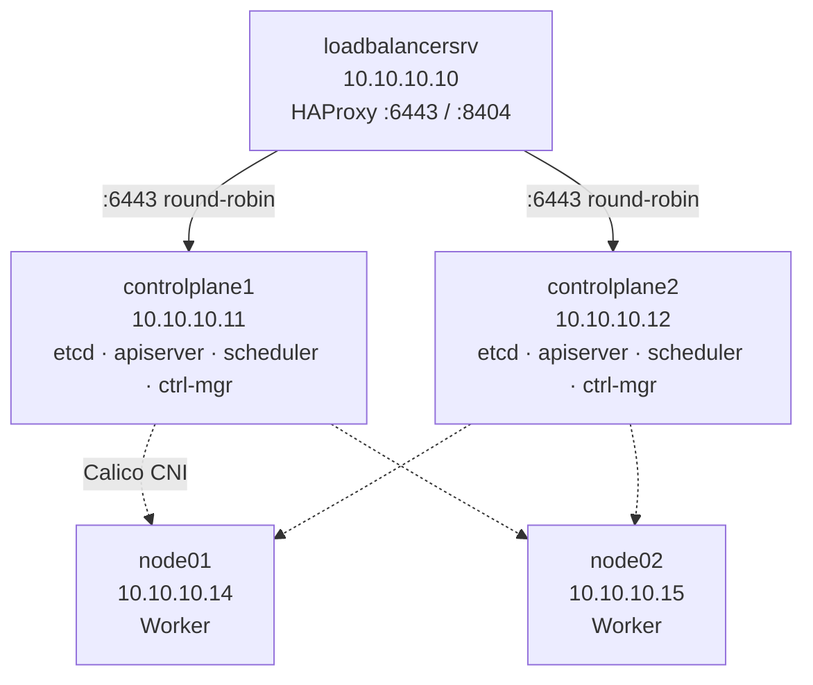
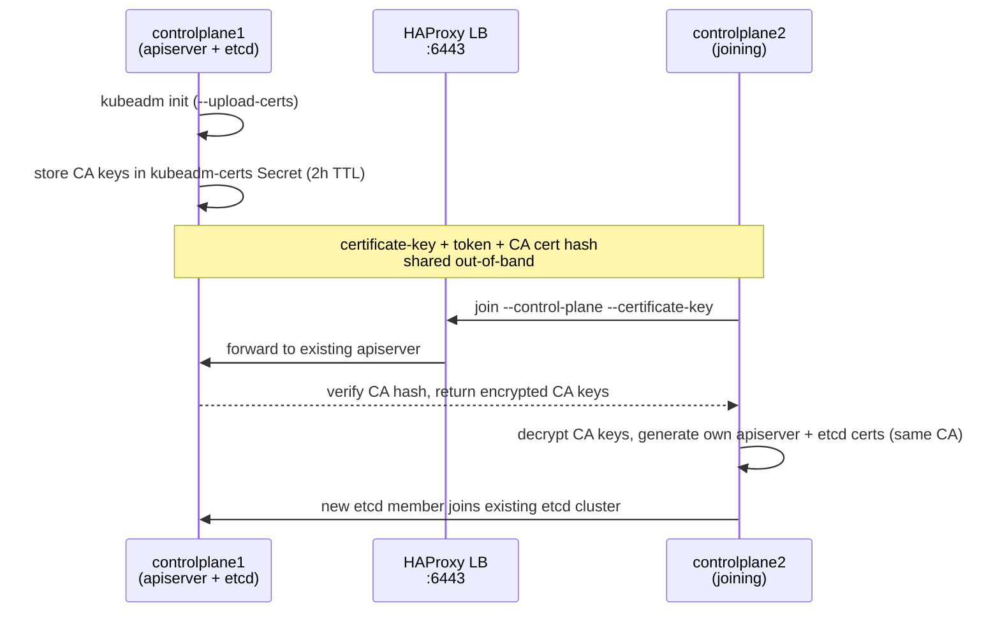
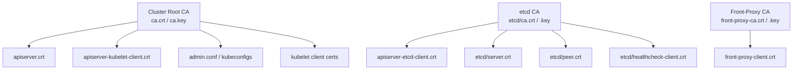
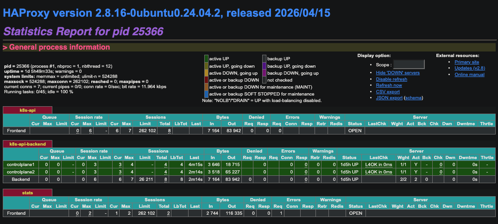

# k8s-ha-cluster

Production-style **high-availability Kubernetes cluster** built from scratch with `kubeadm` — two stacked control planes behind an HAProxy load balancer, Calico CNI, and a full set of idempotent automation scripts you run over SSH. Includes a deep dive into the cluster PKI, certificate lifecycle, and the failure modes you actually hit when bootstrapping HA.

[](LICENSE)


> Originally part of [cka-mindmap](https://github.com/compufreq/cka-mindmap); split into its own repo because the HA build stands on its own as a reference and a CKA/CKS study lab.

---

## Architecture



| Hostname        | IP          | Role                  |
| --------------- | ----------- | --------------------- |
| loadbalancersrv | 10.10.10.10 | HAProxy load balancer |
| controlplane1   | 10.10.10.11 | Control Plane 1       |
| controlplane2   | 10.10.10.12 | Control Plane 2       |
| node01          | 10.10.10.14 | Worker 1              |
| node02          | 10.10.10.15 | Worker 2              |

- **Load balancer:** HAProxy on `loadbalancersrv`, round-robins API traffic (`:6443`) across both control planes; stats dashboard on `:8404`.
- **Control planes:** stacked etcd topology — each runs `etcd`, `kube-apiserver`, `kube-controller-manager`, `kube-scheduler`.
- **Workers:** run application workloads.
- **CNI:** Calico (pod CIDR `192.168.0.0/16`).
- **Runtime:** containerd with `SystemdCgroup`.
- **Kubernetes:** v1.35.

---

## What this repo covers

- Bringing up a **true HA control plane** (2 control planes + LB) — not a single-node toy cluster.
- The complete **cluster PKI**: what `kubeadm init` generates under `/etc/kubernetes/pki/`, how `--upload-certs` and the certificate key let a second control plane join, and which certs are shared vs. regenerated per node.
- **Certificate lifecycle**: expiry, manual and upgrade-driven renewal, kubelet client-cert auto-rotation, and a monthly cron expiry check.
- **Firewall design** (UFW) with the exact ports each role needs, including Calico BGP/VXLAN/Typha.
- A real **troubleshooting playbook** for the failures that actually break HA joins (swap left on, missing IP forwarding, stale etcd members, expired tokens/cert keys, NotReady nodes, HAProxy backends down).

---

## How HA join & certificates work

The trickiest part of an HA build is the second control-plane join — how `kubeadm` shares the cluster CA so both control planes trust each other.



Every component cert chains back to one of three CAs generated by `kubeadm init`:



Full detail — what's shared vs. regenerated per node, expiry, and renewal — is in [`guide.md`](guide.md#what-this-does-certificates--pki).

---

## Repository layout

```
.
├── guide.md            # Full step-by-step walkthrough (start here for the deep detail)
├── LICENSE             # MIT
├── README.md
└── scripts/
    ├── env.sh                      # Configuration: hostnames, IPs, versions, SSH user
    ├── 01-setup-hosts.sh           # /etc/hosts on all 5 nodes
    ├── 02-setup-firewall.sh        # UFW rules per role
    ├── 03-setup-haproxy.sh         # HAProxy on the load balancer
    ├── 04-install-k8s-packages.sh  # kubeadm / kubelet / kubectl
    ├── 05-init-cluster.sh          # kubeadm init on controlplane1
    ├── 06-join-controlplane.sh     # Join controlplane2
    ├── 07-join-workers.sh          # Join node01 + node02
    ├── 08-install-calico.sh        # Install Calico CNI
    ├── 09-verify.sh                # Cluster health checks
    ├── 10-setup-certs.sh           # Certificate verification
    └── deploy-all.sh               # Orchestrates all 10 steps
```

---

## Prerequisites

- **5 Linux hosts** (Ubuntu tested) — VMs or bare metal — reachable on a shared network, matching the IP plan above (edit `scripts/env.sh` to use your own).
- SSH access to all five from your workstation, with a user that can `sudo`.
- On **all Kubernetes nodes** (not the LB), the scripts handle: disabling swap, loading `overlay` + `br_netfilter`, enabling IP forwarding, installing/configuring containerd, and installing `crictl`. See [`guide.md`](guide.md#prerequisites) for what each step does and why.

---

## Quick start (automated)

```bash
# 1. Clone
git clone https://github.com/compufreq/k8s-ha-cluster.git
cd k8s-ha-cluster

# 2. Set your SSH user, hostnames, IPs, and versions
$EDITOR scripts/env.sh

# 3. Make scripts executable
chmod +x scripts/*.sh

# 4. Run the whole build from your workstation (over SSH)
./scripts/deploy-all.sh
```

Run individual phases instead:

```bash
./scripts/deploy-all.sh --from 5     # Resume from step 5 (cluster init)
./scripts/deploy-all.sh --step 2     # Run only step 2 (firewall)
./scripts/deploy-all.sh --step 10    # Run only cert verification
```

## Manual / learning path

If you'd rather understand each phase, follow [`guide.md`](guide.md) top to bottom — it walks through the same ten steps by hand with full explanations, expected output, and the certificate internals at each join.

---

## Verifying the cluster

```bash
kubectl get nodes -o wide          # all 4 nodes Ready
kubectl get pods -n kube-system    # control-plane components (2 of each)
kubectl get pods -n calico-system  # Calico Running
sudo kubeadm certs check-expiration
```

All four nodes Ready:

All four nodes Ready — two control planes, two workers:

```console
$ kubectl get nodes -o wide
NAME            STATUS   ROLES           AGE   VERSION   INTERNAL-IP   EXTERNAL-IP   OS-IMAGE             KERNEL-VERSION      CONTAINER-RUNTIME
controlplane1   Ready    control-plane   96d   v1.35.1   10.10.10.11   <none>        Ubuntu 24.04.4 LTS   6.8.0-111-generic   containerd://2.2.3
controlplane2   Ready    control-plane   96d   v1.35.1   10.10.10.12   <none>        Ubuntu 24.04.4 LTS   6.8.0-111-generic   containerd://2.2.3
node01          Ready    <none>          96d   v1.35.1   10.10.10.14   <none>        Ubuntu 24.04.4 LTS   6.8.0-111-generic   containerd://2.2.3
node02          Ready    <none>          96d   v1.35.1   10.10.10.15   <none>        Ubuntu 24.04.4 LTS   6.8.0-111-generic   containerd://2.2.3
```
Two of each control-plane component — the proof this is genuinely HA, not single-control-plane:

```console
srvadmin@controlplane1:~$ kubectl get pods -n kube-system
NAME                                    READY   STATUS    RESTARTS      AGE
coredns-7d764666f9-6k69c                1/1     Running   2 (25d ago)   96d
coredns-7d764666f9-qllgn                1/1     Running   2 (25d ago)   96d
etcd-controlplane1                      1/1     Running   2 (25d ago)   96d
etcd-controlplane2                      1/1     Running   2 (25d ago)   96d
kube-apiserver-controlplane1            1/1     Running   2 (25d ago)   96d
kube-apiserver-controlplane2            1/1     Running   2 (25d ago)   96d
kube-controller-manager-controlplane1   1/1     Running   2 (25d ago)   96d
kube-controller-manager-controlplane2   1/1     Running   3 (25d ago)   96d
kube-proxy-7km68                        1/1     Running   2 (25d ago)   96d
kube-proxy-kkbwv                        1/1     Running   2 (25d ago)   96d
kube-proxy-lr8xx                        1/1     Running   2 (25d ago)   96d
kube-proxy-pw5r4                        1/1     Running   2 (25d ago)   96d
kube-scheduler-controlplane1            1/1     Running   2 (25d ago)   96d
kube-scheduler-controlplane2            1/1     Running   3 (25d ago)   96d
```
HAProxy stats: open `http://10.10.10.10:8404/stats` — both control-plane backends should be **UP**.



---

## Troubleshooting

`guide.md` includes fixes for the common HA bootstrap failures:

- `ip_forward` not set to 1 (preflight error)
- swap left enabled → kubelet crash-loop → misleading "etcd member not started"
- stale etcd member after a failed control-plane join (full cleanup procedure)
- expired join tokens (24h) and certificate keys (2h)
- nodes stuck `NotReady` (Calico), HAProxy backends `DOWN`, post-renewal cert errors

See [Troubleshooting](guide.md#troubleshooting).

---

## Why I built this

Hands-on practice for the **CNCF certification track** (CKA / CKS) and a reference for standing up HA Kubernetes the hard way — kubeadm, stacked etcd, and a load balancer — so the cert lifecycle and join mechanics aren't a black box. Part of my broader [platform/SRE portfolio](https://github.com/compufreq).

---

## License

Released under the [MIT License](LICENSE). © 2026 Alaa Alhorani.